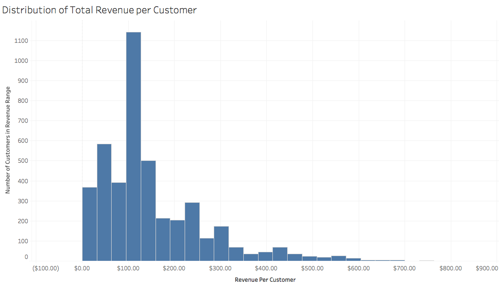
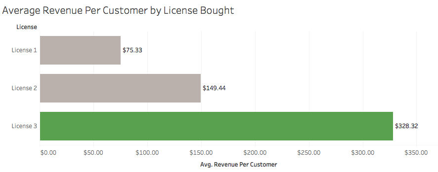
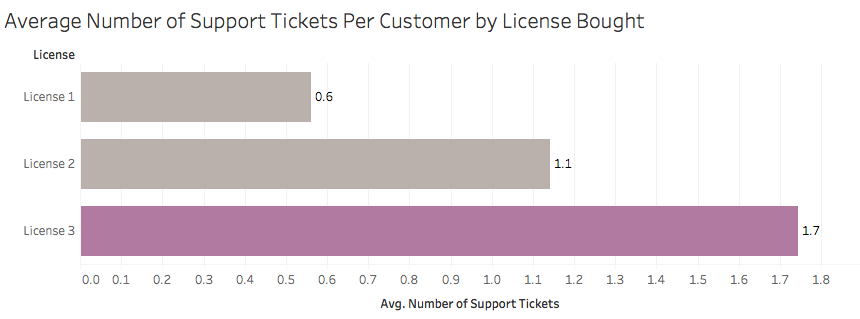
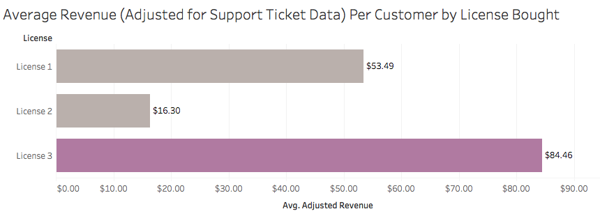
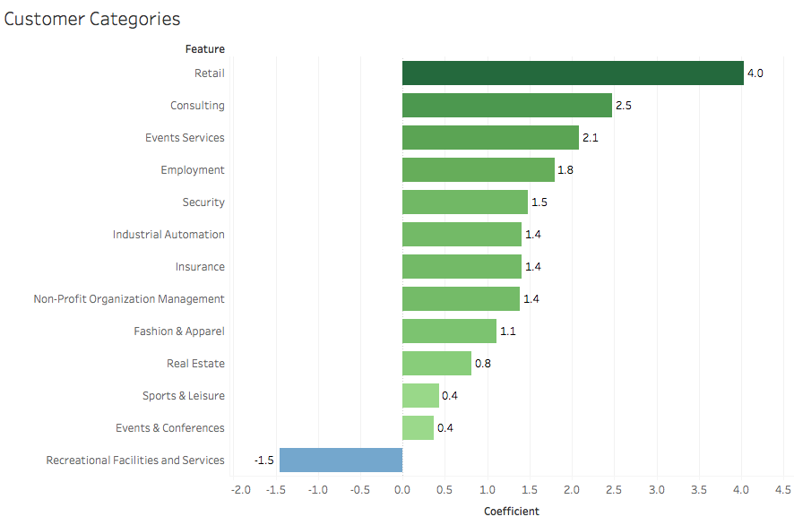
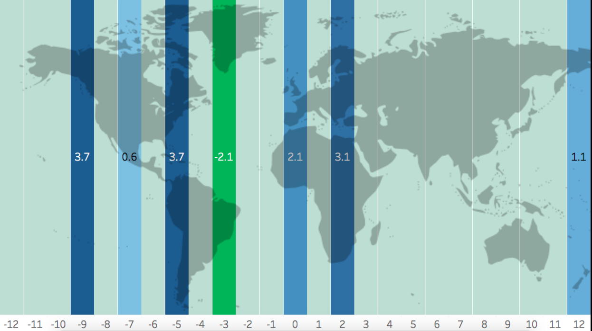

## Not All Customers Are Created Equal

Have you ever wondered who your most valuable customers are? This project, created for a software company, sought to identify those who stand out above the rest.

### Project Goals

* Which group of customers generate the most revenue?
* Which will generate more revenue - many small purchases with little support work or a few large purchases with many hours of support work needed?
* What factors contribute to a customer being more likely to be more profitable?

### Data Sources

Note: These data sources are stored separately in a private repository and contain data from 07/2014 through 08/2017.

* Mechanical Turk - Data from past experiment of identifying customers' website categories
* Intercom - Tracks data on customer communication such as Facebook messages and live webpage chat
* Drip - Tracks data on email related customer communication
* EDD - Tracks data on customer purchases
* Google Analytics - Tracks data on customer webpage browsing
* HubSpot - Tracks data on marketing and sales campaigns
* HelpScout - Tracks data on support tickets

### Technologies Used

* Python
* Pandas
* Numpy
* AWS (EC2 instances)
* Sklearn
* Tableau

### Summary

A combination of utilizing APIs (Google Analytics, Helpscout) and direct downloads was used to obtain data from the above sources.

The first step was cleaning and merging the data sources. A large portion of the data were filled with nulls and/or unusable in its current form without extensive feature engineering. Several notable data cleaning steps included condensing multiple rows of transaction and support ticket data to summary columns for each customer, filling null values with a smaller regression model, and identifying and dropping website testing transactions from the analysis.

Furthermore, given that the data was coming from different sources, there were practically no primary keys to connect the data sources. Instead, a combination of customer emails and engineered domain information were used to combine datasets.

Given that the goal was to predict high value customers, some initial regression models were created to predict revenue per customer. Techniques used included ElasticNet regression, KNeighbors, decision trees, SVC, SGD, and random forests. However, these predictions had too large of errors to be as useful as desired.

Given these results, other ways of measuring customer value were explored. The company studied had three different software licenses available, with License 1 being the least expensive and License 3 being the most expensive.

After discussions with the company, it was decided that revenue was only part of what made a customer valuable. In addition, customers that had a low quantity of support tickets and/or tickets that were open for shorter periods of time required less support work, and were thus very valuable to the company.

Based on internal calculations, it was decided that for a given customer, each day that a support ticket remained open was a loss in revenue of $10. Using the total revenue minus adjustments for support tickets, an adjusted revenue per customer was calculated.

Despite the fact that License 3 customers tended to submit more support tickets, this group still brought in the most revenue per customer on average, while the License 2 group brought in the least revenue.

Based on these findings, customers who bought License 3 were determined to be highly valuable, and thus were the target of the rest of the study.

Given that only 24% of customers chose to buy this license, several techniques for imbalanced classes were tested, including stratifying the classes and using SMOTE to create synthetic samples. Next, various classification models were tested to determine which customers were more likely to buy this license at any point. Specifically, the following techniques were tested: logistic regression, KNeighbors, decision trees, SVR, SGD, bagging methods, and random forests.

Simpler methods performed similarly to the more complex methods, so a basic logistic regression was chosen as the final model to maximize explainability. This model was able to classify which customers would purchase License 3 with an overall accuracy of 81% (precision 73%, recall 81%).

Initially, many features seemed to be predictive of purchasing this high value license. However, after retesting the model after dropping various variables, the model was able to achieve a similar accuracy rate with only twenty of the most predictive features.

Customer industry was a major predictor, with customers who had websites centered around retail, consulting, or event services being far more likely to buy License 3.

Customer location (measured by UTC offset time zones) was the other major predictor, with customers in Alaska and the Northeast US being most likely to buy License 3, and those in areas of South America such as Argentina and Brazil being less likely to buy this license.

Potential directions for future studies include: continuing to test regression models for customer revenue after transforming the revenue variable, adding features to the existing model related to text analysis of website descriptions and support ticket text, developing a model to predict website visitors who are most likely to continue on to make a purchase, and developing a model to predict warning signs for customer churn.
